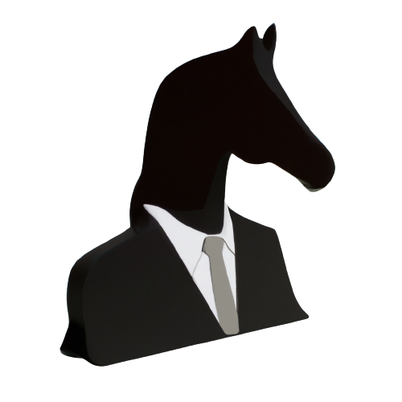

<p align="center">
    
</p>

# Xiron
A lightweight 2D robot simulator written in Rust.

# Installation
1. Clone the repository
```
git clone https://github.com/SuhrudhSarathy/xiron.git
```
2. Use `cargo` to build
```
cargo build
```

# Example
In `main.rs`, an example to move the robot using arrows keys is given. To run the example
```
cargo run
```