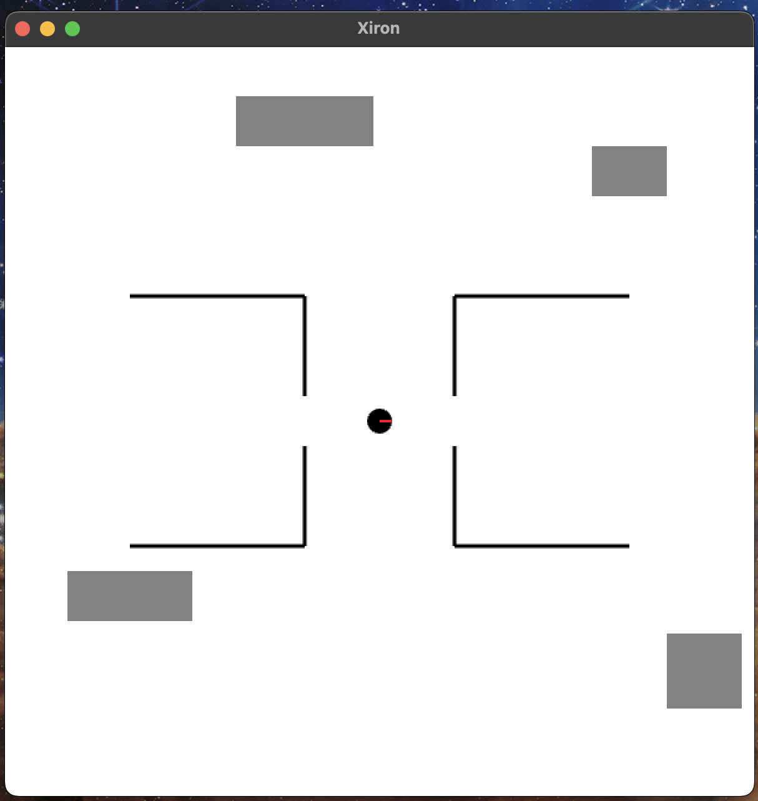
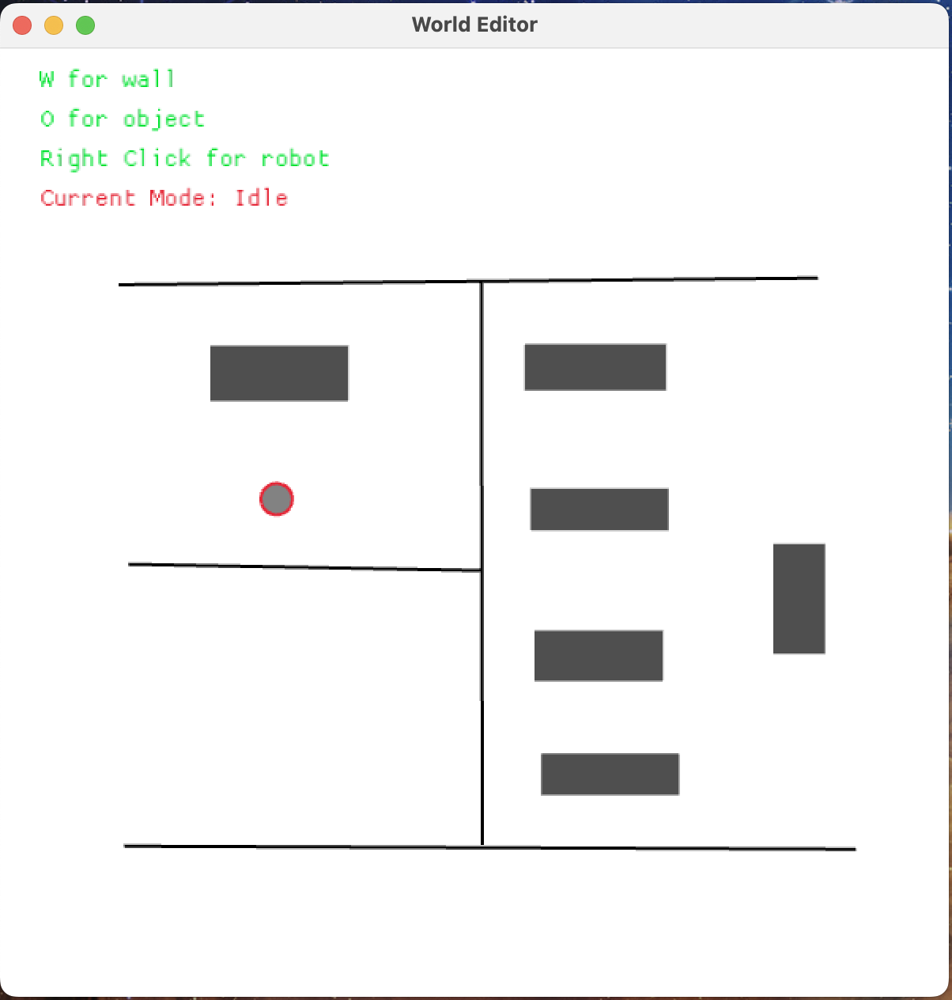

<p align="center">
    
</p>

# Xiron
A lightweight 2D robot simulator written in Rust.

# Installation
1. Clone the repository
```
git clone https://github.com/SuhrudhSarathy/xiron.git
```
2. Use `cargo` to build
```
cargo build --release
```

# Simulator
There are multiple ways to use Xiron as a simulator. You can simulate your configuration using a simple loop where you update the kinematics and render sequentially or use two different processes to go completely async. The example [path_tracking](examples/path_tracking) gives an example of the first method.

The simulator can also be run asynchronously with or without rendering. The [Simulator](src/bin/simulator.rs) updates the kinematics, performs collision checks etc. and the [Renderer](src/bin/renderer.rs) renders the scene asynchronously. This allows us to run the simulation in headless mode without having to render the scene.

The __Simulator__ communicates with the __Renderer__ about the current scene using ZeroMQ messaging queue. The __Simulator__ exposes a websocket connection at port `localhost:8081` to send control inputs for the robot(s) present in the scene. A sample websocket client in Rust is implemented [here](examples/websocket_client). Websocket clients in Python, C++ will be available in the future.

## Instructions
1. Run the simulation server using cargo
```bash
cargo run --bin simulator /path/to/config
```

2. Run the rendered using cargo
```bash
cargo run --bin renderer /path/to/config
```

3. Run the client
```bash
cargo run --example websocket_client
```
The client sends velocity commands to the server to command the robot to move in circles.

## Export Simulator and Renderer
Since rust provides completely self-contained binaries, exporting the _simulator_ and _renderer_ binaries and running them standalone should work fine.

# Examples
Examples are in the [examples](examples) directory.

<p align="center">
    
</p>

# World Editor
You can use the [World Editor](src/bin/world_editor.rs) to create a config file using a GUI. That config file can be then used to load the simulation world.

<p align="center">
    
</p>

# Roadmap
The Roadmap is mentioned in the [Projects](https://github.com/SuhrudhSarathy/xiron/projects) section.