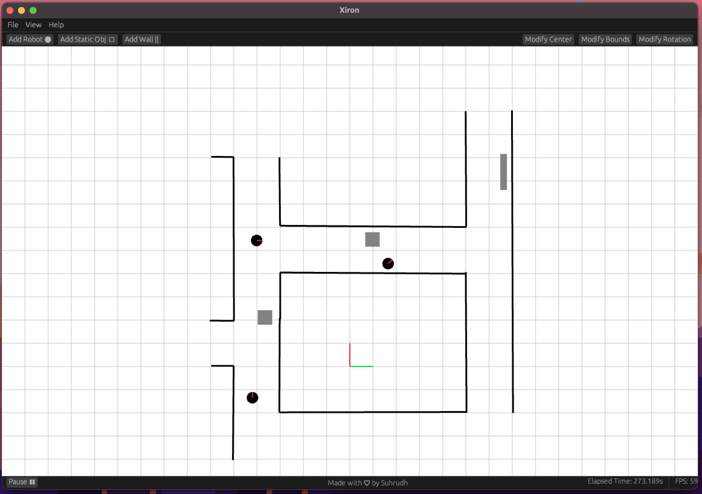

# Getting Started with Xiron

`xiron` is a light weight 2D Robot Simulator written entirely in the [Rust Programming language](https://www.rust-lang.org). `xiron` was intended to be used for two purposes. Firstly, it is aimed to reduce the entry barrier to the field of Robotics by proiving an easy to use 2D simulator. Secondly, it is intended to provide a fast and light weight simulator to test and prototype navigation algorithms without the use of realistic simulations.

## Inspiration
The inspiration to develop Xiron came from a basic need to setup up quick simulations. There were limited simulators that were independent of ROS and had a simple Python interface that fit my use case. Additionally, I wanted to learn more about the Rust Programming Langauge and ended up using it for the project.

## Great Alternatives
Some great alternatives that provide simple 2D robot simulations  
1. [Flatland Simulator](https://flatland-simulator.readthedocs.io/en/latest/overview.html) : Perfromat 2D simulator developed by Avidbots Corp  
2. [Pyrobosim](https://pyrobosim.readthedocs.io/en/latest/) : Pyrobosim is a ROS 2 enabled 2D mobile robot simulator for behavior prototyping.

## Overview
* User Guide:
    * [Configuration](./user_guide/configuration.md)
    * [GUI usage](./user_guide/gui_usage.md)
    * [Python Interface](./user_guide/python_interface.md)
* Advanced Usage
    * [Customising Robot Model](./advanced/robot_model.md)
    * [Multi Robot Usage](./advanced/multi_robot_usage.md)

## Contributions
Feel free to contribute to the project. Take a look at the [Contributor's Guide](./contributions.md) for more information.
    
